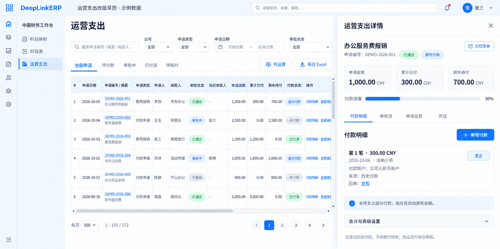
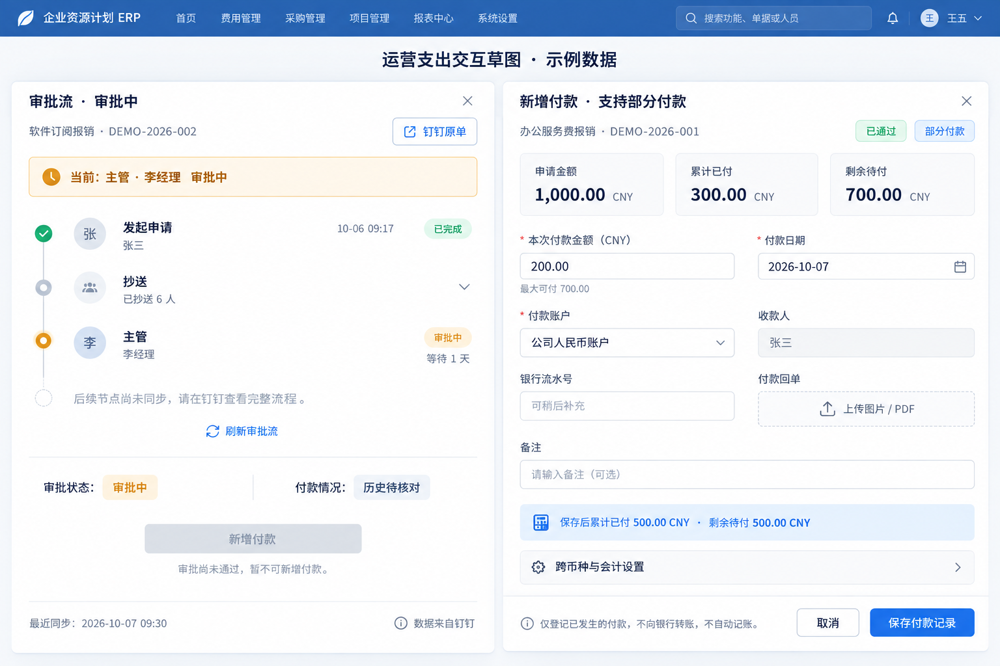

# 运营支出审批流与简明付款改造计划

> **For agentic workers:** REQUIRED SUB-SKILL: Use superpowers:executing-plans to implement this plan task-by-task after design confirmation. Steps use checkbox (`- [ ]`) syntax for tracking. Do not start deployment or financial writes merely because this plan exists.

**Goal:** 在现有运营支出页面完整呈现可核对的钉钉审批信息，让财务直接查看并登记多次部分付款，保留历史核对、权限及凭证草稿边界。

**Architecture:** 扩展已有 OA 来源、出纳审批解析及受保护的导出接口；审批读取不再依赖出纳批次是否导入。复用 ERP 现有付款登记、余额、幂等及凭证草稿服务，仅简化交互，不另建付款账本或运营支出页面。

**Tech Stack:** Frappe/ERPNext、deeplinkerp_branding Python/JS/CSS、出纳 FastAPI/SQLite、只读 PostgreSQL OA 来源、pytest、Node test、真实浏览器验收。

---

## 0. 状态、范围与证据边界

本文件已于 2026-10-07 由用户批准实施，正在现有工作树开发和本地验收；尚未发布本轮代码。生产审批、历史付款、公司人工确认及凭证不自动修改。

- ERP 工作基线：`codex/operating-expenses`，HEAD `461043b`；当前生产运行镜像对应 `b634a527c54a`。
- 出纳适配工作基线：`codex/erp-operating-export`，HEAD `59ef958`。
- 不覆盖原有未提交的文档、截图或其他任务修改；实施前重新核对分支和统一发布负责人。
- ERP 生产在 **Vultr**。阿里云承担出纳/来源适配，不是 ERP 部署目标。
- 本次不停止出纳网站；不重写采购支出流程；不改银行实际转账接口；不提交或过账真实凭证，不结账。
- 图中名称、金额、审批时间和账号是 **设计示例**；不能用示例的 0 元替代真实未知余额。

## 1. 整体排查结论

### 当前 372 张 ERP 运营支出来源单

- 原始 OA 身份全部找到：372/372。
- 372 张都有原始审批操作历史；369 张有任务节点。没有任务的 3 张仍能呈现已有历史，不编造当前节点。
- 118 张已匹配 ERP 使用的出纳根身份；254 张没有。当前 `get_approval_timeline` 对没有根身份的记录直接返回空列表，这不是原单真的没有审批流。
- 254 张未匹配根身份中，已结束 189、已终止 57、审批中 8；缺失不限于审批中的单据。
- 14 张整体状态为审批中，原始任务可提供当前审批人；当前接口仅导出缓存操作历史，遗漏当前任务。
- 188 张申请人显示为数字 ID。另有 242 张结构化申请人 ID 与原始 `originatorUserId` 不一致；不能把主管任务处理人当成发起人。
- 269 张当前历史付款金额未知；`—` 不等于 0，不可推断均未付款。

### 截图单核验

申请编号 `202609300917000345406` 的原始状态是 `RUNNING`，发起人为王翔，当前任务是主管翟泽洋审批中。ERP 当前却显示申请人数字 ID、没有审批节点，并用“审批未通过或已撤回”概括不能付款。这三个展示问题可以独立复现。

### 出纳规则对照

- 出纳网站登记付款主要检查财务角色、批次可编辑性、ERP 是否已经接管、金额是否超余额；不是一律要求钉钉整单 `COMPLETED`。
- ERP 当前要求整体 `COMPLETED + agree`。如果整单最后一步是出纳办理，先要求整单完成才登记付款可能形成流程循环。
- 本次明确区分：**审批状态、可登记付款资格、付款情况、凭证状态**。不能只改文字后仍让四者共享同一个布尔值。
- 尚未获得业务确认时保持现有付款阻断规则。允许“只剩出纳办理”不能仅靠节点中文名猜测，需模板的必审节点清单、有效同意记录和实际未完成任务共同证明。

### 尚不能确认的事项

- 钉钉尚未产生的后续节点不一定在数据库任务中，不能承诺恢复完整未来流程图。
- 原始事件时间与钉钉界面存在时区展示差异的疑点；须对照带时区原值与原单，不能统一减 8 小时。
- 242 张身份不一致可能影响来源公司解析，但不意味着 242 张公司的归属已经错误；必须生成核对预览，保留人工确认值。
- OA 单号并非稳定的全局唯一键。既有按单号去重的读取助手在此次规范化查询中返回 370 而非 372，不能直接套用作新接口。

## 2. 图片草图与交互决策

### 草图一：紧凑列表与付款明细



- 保留“中国财务 → 科目表 → 运营支出”的现有导航关系；不全局换导航。
- 蓝白紧凑列表，默认 13px、约 30px 行高，表头和冻结列对齐，鼠标可拖动的横向/纵向滚动条始终可发现。
- 默认列：申请日期、申请编号/摘要、申请类型、申请人、收款人、审批状态、当前审批人、申请金额及币种、累计已付、剩余待付、付款状态、操作。公司、项目、来源及凭证状态放在可配置列中。
- 两类申请只叫“付款申请”“费用报销”；草图含办公用品等摘要，不因此新增第三种申请类型。
- 快捷视图为全部申请、待付款、审批中、已付清、待核对；每个视图与筛选、计数、合计、导出共用条件。
- 列表操作“付款明细”“查看审批”均在原页面抽屉打开，不强制跳转复杂单据表单。
- 抽屉默认付款明细；申请金额、累计已付、剩余待付仅显示一次，并展示付款进度、每笔日期/账户/金额/回单。
- 已同步历史付款只读展示来源，不给“直接编辑/删除”；错误记录沿用现有冲正、更正及审计机制。
- 默认每页 100，复用既有分页与每页选项；图片行数只是示例，不是页面条数上限。

### 草图二：审批流与新增付款



- 审批流默认突出“当前：主管 · 某某 · 审批中”；已发生节点按真实时间显示，抄送默认折叠。
- 同时存在多个当前审批人时并列呈现，不只截取最后一个人；已完成的最后一条操作不得冒充当前节点。
- 未取得的后续节点提示“后续节点暂未取得，请查看钉钉完整流程”，保留原单链接及最近同步时间。
- 新增付款常规表单：本次金额、付款日期、付款账户、收款人，另有可选银行流水号、付款回单和备注。
- 同币种自动把实付金额等同于本次金额，不要求财务重复填写。跨币种才展开申请币种抵扣、银行实付币种/金额、汇率与费用，沿用服务端校验，禁止猜测汇率。
- 账户列表展示业务友好名称，隐藏专业科目编号；费用科目/往来方映射由有权限人员一次维护，不能因为隐藏字段而删除会计约束。
- 保存前显示结果：申请 1,000.00、已付 300.00、本次 200.00，则累计 500.00、剩余 500.00。
- 按钮叫“保存付款记录”，底部明确“仅登记已经发生的付款，不向银行转账，不自动记账”。凭证单独预览并保存草稿。
- 历史待核对只出现一个简明阻断提示和“核对历史付款”入口，不重复堆叠技术说明或假装已核对。

## 3. 状态与付款边界

### 审批状态

建议简明状态：审批中、已通过、已拒绝、已终止、待同步。`TERMINATED` 默认“已终止”；只有原始撤回事件能证明时才显示“已撤回”。

关键判断示意（实施时放在已有服务，前端只呈现服务结果，不复制判断）：

```python
def approval_state(status, result, *, explicit_withdrawal=False):
    status = str(status or "").strip().upper()
    result = str(result or "").strip().lower()
    if status == "RUNNING":
        return "pending"
    if status == "COMPLETED" and result in {"agree", "approved"}:
        return "approved"
    if status == "COMPLETED" and result in {"refuse", "rejected"}:
        return "rejected"
    if status == "TERMINATED":
        return "withdrawn" if explicit_withdrawal else "terminated"
    return "unknown"
```

付款资格另返回 `can_register_payment` 与简短 `blocked_reason`。审批中但历史已经付过款的单，可显示既有付款事实，不能因此开放下一笔付款。

### 付款情况

- 历史可靠且累计 0：未付款。
- 历史可靠且大于 0、小于申请金额：部分付款。
- 历史可靠且余额 0：已付清。
- 来源不完整、身份/币种/金额冲突：历史待核对或数据待核对，已付/余额展示 `—`。
- 金额固定两位；按币种分别汇总，不把 CNY、MXN、USD 直接相加。
- 凭证状态单独显示未生成、草稿、已关联及相应权限；登记付款不会自动生成 GL。

### 已确认的付款规则及证据要求

建议：所需主管、总经理和财务审批均已通过，且只有经模板确认的出纳执行任务未完成时，允许出纳登记已经发生的付款。主管审批中、审批拒绝/终止、缺失必审证明均不允许。

用户已确认该规则。后端写入时必须重查来源版本、必审节点、当前任务及权限；不能只相信列表上的状态、人工前端按钮或“出纳”文字。现场接口尚未提供可验证的历史模板版本与必审路由，模板不明的在办单仍阻断；功能配置不得凭节点名或不完整节点目录猜测。

## 4. 已有能力复用与改动边界

ERP 路径均相对 Branding 应用根目录；出纳路径相对 `cashier-payment-archive` 根目录。

- `deeplinkerp_branding/services/operating_oa_source.py`：复用范围、身份、原始申请解析；修复发起人优先级，保留人工覆盖。将逐条匹配候选改为批量身份索引，不复制第二套来源读取器。
- `deeplinkerp_branding/services/operating_expenses.py`：复用原有同步/查询、公司权限、详情、总计、Excel；重写混合审批文案，批量关联摘要。
- `deeplinkerp_branding/services/operating_payment_service.py`：扩展审批读取和 OA-only 历史核对，保留事务锁、版本、幂等、余额、冲正、私有回单授权及草稿边界。
- `deeplinkerp_branding/services/operating_payment_contract.py`：复用 Decimal 金额、余额与历史一致性，不引入 float 金额路径。
- `backend/app/external_expenses.py`：复用现有操作解析、任务解析、用户名批量读取及原单 URL；补 `taskGroupName`，按企业/实例精确读取，不沿用按申请单号去重规则。
- `backend/app/erp_export.py`：扩展既有受保护的 workflow 和 takeover 契约，不创建独立“运营审批服务器”。
- `backend/app/db.py`：已有接管账本补 OA 唯一身份；已有来源/导入写入入口按同一身份检查接管状态。
- `deeplinkerp_branding/public/js/operating_expenses.js`、`operating_expense_drawer.js`、`operating_payment_panel.js` 与 `public/css/operating_expenses.css`：复用共享紧凑列表、抽屉、上传器和精确分计算，替换重复展示与表单。

### 统一审批接口

扩展既有 `/api/integrations/erp/operating-expenses/workflow`，OA 记录传精确 `corp_id` 和 `process_instance_id`；旧出纳记录仍可传 `source_id`。同时提交的身份矛盾时拒绝，不自动降级按单号查询。

返回契约示例：

```json
{
  "schema_version": 2,
  "items": [{
    "source_id": "oa:example-hash",
    "corp_id": "test-corp",
    "process_instance_id": "test-instance",
    "lookup_status": "found",
    "approval_status": "RUNNING",
    "approval_result": null,
    "originator": {"id": "test-u1", "name": "张三"},
    "events": [{"id": "start-1", "stage": "发起申请", "operator": "张三", "time": "2026-10-07T09:00:00+08:00", "result": "START", "current": false}],
    "current_tasks": [{"id": "task-1", "stage": "主管", "assignees": [{"id": "test-u2", "name": "李经理"}], "status": "RUNNING"}],
    "source_updated_at": "2026-10-07T09:01:00+08:00",
    "last_synced_at": "2026-10-07T09:02:00+08:00",
    "original_url": "dingtalk://example-original-instance"
  }]
}
```

- 示例 URL 不是可部署的钉钉 URL；实现继续使用现有经检查的原单 URL 构造器，验证协议和实例身份。
- ERP 先用 `_source` 验证该记录和公司访问权限，浏览器不直接接触数据库或来源令牌。
- 来源适配保持认证，新增企业/审批模板/执行地区/时间范围白名单；OA-only 来源不能依靠空出纳根身份绕过限制。无法证明授权范围即拒绝，不返回任意钉钉实例。
- 列表只缓存精简摘要；完整审批历史在展开时读，附件手动按单加载。不逐行发起网络请求，不扫描全库原始 JSON。
- 缓存以精确身份及来源版本为键，刷新或来源版本变化失效；详情显示原始更新时间与本次同步时间，不能把刚读到旧快照称为已获取钉钉实时状态。

### OA-only 付款与双系统防重复

237 张来源申请在出纳请求表中不存在；仅给它们补审批流仍不足以支持 ERP 首笔付款。扩展现有接管机制，而不是制造假的出纳请求。

- 历史核对按 OA 企业/实例身份进行，合并已核对的真实历史；没有导入不等于没有支付。
- 确无历史付款必须由有权限财务明确确认，保存确认人、时间、依据及版本；有历史须保存可核对的付款明细，未知或冲突不能接管。
- 接管账本为 OA 身份建立唯一键，旧 `logical_request_id` 保留兼容关联。同一身份不能同时由出纳和 ERP 写付款。
- 网站后续导入/复制出纳请求时也按 OA 唯一身份检查接管，不允许“ERP 先接管、网站晚导入”绕过锁定。
- 支持幂等重试、双方超时后的状态核对，不对同一确认重复建立接管或付款。
- 不自动接管全部 372 张，不自动把 269 张未知记录确认成零；整批工作只修复可核对的来源和展示。

## 5. 算法思路与复杂度

输入目前 N=372 条 ERP 来源；出纳候选 C、唯一用户 U、审批事件/任务合计 E 会继续增长。同步/导出仍使用有界分页，单批至多 500。

朴素做法：每个申请重扫出纳候选、单独查用户/审批、每个当前任务再反扫完整事件。主要瓶颈是 O(N×C) 匹配、N+1 数据库/HTTP 请求及重复解析/排序。

改造思路：

1. 一次构建 `(corp_id, process_instance_id)` → 候选列表索引，保留全部冲突候选，不以最后一条覆盖。
2. 每批一次提取唯一用户 ID，批量建立 `(corp_id, user_id)` → 姓名索引，阻止跨企业同 ID 串人。
3. 每份历史仅解析一次；事件按稳定时间/序号排序一次，必要的任务阶段索引预处理一次，避免每个任务重新反扫历史。
4. 列表只读摘要；抽屉按需完整读取。已算余额、状态、来源摘要一次返回，渲染不再次扫描付款集合。
5. 数据库精确身份查询须检查查询计划及索引，不在 SQL 中对所有历史 JSON 反复做无索引搜索。

目标业务处理时间 O(N+C+U+E log E)，已按稳定顺序读取事件时可达 O(N+C+U+E)；工作空间 O(N+C+U+E)，按批有界。数据库 IO 次数按批数而非申请条数增长。单笔付款校验继续使用现有事务内有界查询，不拿缓存余额决定是否超付。

自检：是否还有逐行 HTTP、相同候选重复扫描、任务反复遍历事件、重复排序、金额 float 转换、跨企业姓名键、无界附件加载；任何一项存在均不能称为优化完成。

## 6. 实施任务与测试

### 任务一：精确身份审批契约与权限

修改：出纳 `backend/app/external_expenses.py`、`backend/app/erp_export.py`。
测试：扩展已有 `backend/tests/test_erp_takeover.py`、`backend/tests/test_mexico_tracking.py`，输入变体用参数化，不复制完整测试套件。

- [ ] 先加失败用例：OA 无出纳请求仍可读取真实历史；同单号跨企业不合并；同企业不同实例不去重；企业/模板/地区/年份越界拒绝；无效身份不回退。
- [ ] 加当前任务用例：`taskGroupName=主管`、多人会签、完成历史不当当前、3 类无任务结果保留真实历史。
- [ ] 运行 `python3 -m pytest backend/tests/test_erp_takeover.py backend/tests/test_mexico_tracking.py -q`，确认新场景先失败，再修改既有读取器及接口。
- [ ] 重新运行同一命令，确认新旧契约以及墨西哥共用解析器的既有行为不变；审批接口只读，未制造出纳申请。
- [ ] 对此任务独立审查并提交，注明旧契约保留原因。

### 任务二：发起人、审批状态与来源刷新

修改：ERP `operating_oa_source.py`、`operating_expenses.py`、`operating_payment_service.py`。
测试：`tests/test_operating_oa_source.py`、`tests/test_operating_expense_contract.py`、`tests/test_operating_payment_contract.py`。

- [ ] 先加失败用例：原始发起人与结构化主管 ID 不一致，正确显示发起人；人工申请人/公司覆盖不被替换；名字缺失显示“姓名待同步”，详情保留原 ID。
- [ ] 用参数化覆盖 `RUNNING`、`COMPLETED/agree`、`COMPLETED/refuse`、`TERMINATED`、未知状态，不把等待审批显示拒绝。
- [ ] 契约测试补无出纳根审批、有根缓存兼容、返回身份冲突、来源超时/陈旧、权限拒绝、银行/附件 URL 不泄露。
- [ ] 运行 `python3 -m pytest tests/test_operating_oa_source.py tests/test_operating_expense_contract.py tests/test_operating_payment_contract.py -q`，先确认失败，再实现批量摘要和精确实例读取。
- [ ] 按原始 ID 生成身份及公司变更预览；自动刷新可核对的姓名/审批摘要，涉及公司归属或人工确认值的变化必须审查，不批量静默迁公司。
- [ ] 在独立 QA 站点重新跑同一测试集及原生权限测试，确认没有付款/GL/凭证状态改变，再提交。

### 任务三：OA-only 历史核对和唯一接管

修改：出纳 `backend/app/db.py`、`backend/app/erp_export.py`、实际导入/复制与付款写入入口；ERP `operating_payment_service.py`。
测试：既有 `backend/tests/test_erp_takeover.py`、`tests/test_operating_payment_contract.py` 与 `deploy/local/test_operating_payment_concurrency_native_qa.py`。

- [ ] 先加失败用例：OA-only 未确认历史不能付；明确零历史才能接管；真实历史合计不同则拒绝；公司权限不足拒绝。
- [ ] 增加并发和迟到导入用例：同实例两个 claim、重复网络重试、ERP 接管后网站新增/复制请求，均保持单一付款写入者。
- [ ] 扩展现有接管账本唯一身份及核对预览；保留旧根身份入口，迁移只增加接管元数据约束，不改付款金额或状态。
- [ ] 测试支付 1,000/300/本次 200→500/500，超余额、币种不一致、版本已变化、冲正、金额最多两位、重复点击均由服务端校验。
- [ ] 在独立 QA Frappe 站点按现有脚本运行原生事务/并发验证，验证银行数据及真实 GL 不发生写入；审查后提交。

### 任务四：列表、审批流与简明付款表单

修改：`public/js/operating_expenses.js`、`operating_expense_drawer.js`、`operating_payment_panel.js`、`public/css/operating_expenses.css`。
测试：扩展 `tests/operating-expenses.test.js`、`tests/operating-expense-drawer.test.js`、`tests/operating-payment-panel.test.js`，沿用 `tests/compact-page.test.js`。

- [ ] 先加失败用例：付款明细默认标签、申请标题优先、正确审批标签、多当前任务、未知金额不格式化为 0、历史回单只读。
- [ ] 用已有 `paymentPreview` 精确分函数校验 300+200=500，剩余 500；不写另一套金额计算器。
- [ ] 运行 `node --test tests/operating-expenses.test.js tests/operating-expense-drawer.test.js tests/operating-payment-panel.test.js tests/compact-page.test.js`，确认新用例失败后实现草图。
- [ ] 同币种隐藏重复实付字段但向后端提交相等值；跨币种条件展开；缺必要往来方/账户映射给一个可办理入口，不绕过后端校验。
- [ ] 删除本轮替代的重复金额卡、重复技术提示、重复筛选/事件绑定；保留仍有独立功能的原始来源和高级核算区。
- [ ] 重新跑上述测试，独立审查并提交。

### 任务五：整体本地验收与协调发布

- [ ] 真实浏览器验收 1920、1280、390 宽度，经典与 DL 模式；表头/列对齐、鼠标横纵滚动、分页、筛选、刷新、列设置、离开/返回、抽屉关闭重开全部操作。
- [ ] 用本地合成单覆盖未付、部分付、付清、主管审批中、会签、拒绝、终止、未知、历史待核对、源接口异常、受限公司用户及多币种。
- [ ] 使用真实授权账号核验代表性钉钉原单打开到对应实例；先核对时区，确认人员与当前节点一致。链接存在不算内容验收通过。
- [ ] 比较列表/计数/按币种合计/Excel 全部筛选结果，不受当前分页影响；金额两位，来源身份及原始字段可追溯。
- [ ] 全量回归实际相关 Node/Python/native QA 集合，保留命令、结果、跳过和基线失败；不把旧测试报告或 HTTP 200 当本次通过。
- [ ] 与采购及其他在途任务确认一名发布负责人、目标 SHA、迁移顺序、回滚兼容。先发布后向兼容的来源适配，再一次串行发布 Vultr ERP；不同时覆盖容器资源。
- [ ] 上线后只读逐页复核代表单及全部 372 张覆盖摘要；不在生产测试实际付款/冲正/凭证提交。
- [ ] 数据库此前缺失的未来节点只能显示可用性说明；不得为了达到“全量有审批流”把缺失材料伪造成已通过。

## 7. 替代清理与兼容退出

同次清理：无出纳根就返回“没有审批”的快捷分支、不能付款就显示“未通过或撤回”的混合判断、把最后历史事件当当前节点的 ERP 展示依赖、重复金额卡/同币种重复输入、逐条匹配/查姓名、被替代的重复监听及重复测试断言。

不直接删除共用出纳解析器和旧按单号助手：它们仍被网站/MX 流程调用；本次为其扩展精确身份模式，旧调用继续原契约，不能为了 ERP 简化破坏其他地区。

旧 `source_id=logical_request_id` workflow/takeover 兼容保留给旧 ERP 版本和已有接管记录。退出条件：所有运行客户端升级为 v2；旧接管记录可按 OA 身份或明确 legacy 身份解析；日志证明连续一个完整同步周期无旧参数调用；回滚窗口关闭。满足后在后续版本删除适配分支，不能在首次发布同时破坏回滚。

## 8. 交付、自检与本轮未处理项

实施最终报告分别列明：新增、修改、删除、测试变化、重复逻辑、技术债；同口径 `git diff --numstat` 分开业务代码/测试/文档/图片，纳入新文件，排除原有脏改动。测试区分新业务场景与参数化展开数量，不用文件数充当通过数量。

本轮只有计划和图片新增，应用代码新增/修改/删除均为 0；未新增或执行实施回归测试。已执行的是生产及来源数据库只读覆盖查询、现有源码规则对照、截图单浏览器复现、草图视觉检查。

未处理项：上游结构化申请人列的全库修复；242 张的历史公司改写；没有来源证据的未来节点；银行自动转账；真实凭证过账/期间结账；停用出纳网站。关联采购单缺失的文案和手工关联属于另一个采购任务，不在本计划重复实现。

验收硬门槛：没有可核对身份不得串单；没有姓名不展示另一审批人的姓名；未知付款不当 0；没有任务不编造未来节点；审批读取不要求已有出纳批次；查看审批不改变付款归属；简化表单不删除会计/权限/并发约束；保存付款记录不等于转账或记账。
