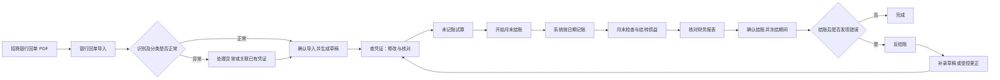
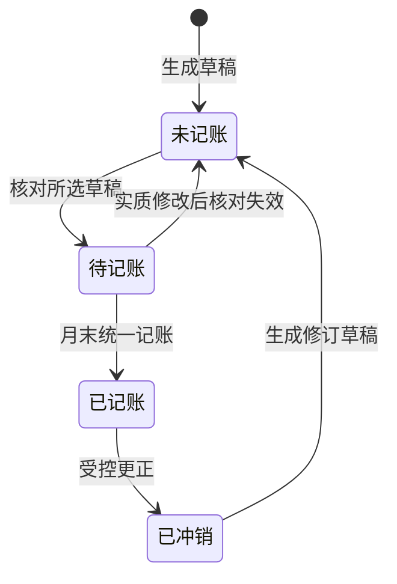
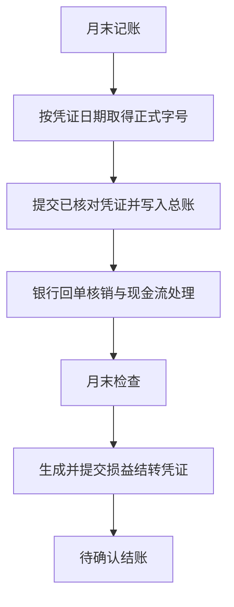

# 银行回单至月末结账与反结账操作 SOP

> 适用对象：出纳、制单会计、复核会计、财务负责人\
> 适用范围：招商银行人民币文字版电子回单，新业务制证、凭证复核、月末结账和反结账\
> 文档版本：2026-09-23\
> 系统路径：**中国财务**

## 1. 这套流程做什么

本流程把银行回单转换为未记账凭证，经过财务核对后，在月末统一记账、生成损益结转和财务报表快照。

日常修改的是**未记账草稿**，不会产生取消或冲销记录。只有月末执行“开始月末结账”后，核对完成的草稿才正式进入总账。



### 1.1 各环节是否影响总账

| 环节 | 是否影响总账和正式报表 | 说明 |
|---|---|---|
| 上传、识别回单 | 否 | 只读取 PDF 并显示识别结果 |
| 生成凭证草稿 | 否 | 创建未记账凭证和银行交易 |
| 编辑、核对草稿 | 否 | 核对后状态变为“待记账” |
| 未记账试算 | 否 | 把草稿纳入预计余额，仅供检查 |
| 开始月末结账 | **是** | 按日期提交已核对草稿并写入总账 |
| 确认结账 | **是** | 生成正式报表快照并冻结期间 |
| 反结账 | **是** | 解除冻结并撤销损益结转，不删除业务凭证 |

## 2. 岗位建议

| 岗位 | 主要操作 |
|---|---|
| 出纳或制单会计 | 上传回单、核对笔数和金额、生成草稿、处理识别异常 |
| 制单会计 | 修改摘要、科目、金额、往来、成本中心、项目和现金流项目 |
| 复核会计 | 核对凭证与原始单据，执行“核对所选草稿” |
| 财务负责人 | 查看试算和财务报表、确认结账、审批反结账 |

系统实际权限以账号角色设置为准。启用了职责分离时，制单、复核和记账应由相应人员完成。

## 3. 操作前准备

每次导入前检查：

- 已从“中国财务”入口选择正确公司。
- 银行账户属于当前公司，已启用，并关联人民币银行明细科目。
- 回单 PDF 是系统已支持银行的文字版电子回单，不是扫描图片或加密文件。目前已支持招商银行、中国银行、中国农业银行、中国工商银行和广发银行的已验收版式。
- PDF 中的本方户名、银行账号与系统银行账户一致。
- 本批回单没有通过其他批次、银行流水或手工凭证重复入账。
- 报销单、合同、发票、工资表、税费或社保明细等业务依据已经备齐。
- 当前月份尚未结账；已结账月份应先按第 9 节反结账。

> **当前支持范围**：单个 PDF 不超过 20 MB、100 页、300 张回单。支持招商银行、中国银行、中国农业银行、中国工商银行和广发银行的已验收人民币文字版回单；新银行或新版式须先用原始文件验证。

## 4. 第一步：选择公司

1. 点击左侧 **中国财务**。
2. 在弹窗中选择本次记账公司。
3. 确认页面顶部或筛选条件中的公司名称正确。

**图 1：公司选择示意**

```text
┌──────────────────── 选择记账公司 ────────────────────┐
│ 公司  [ 悦为智能技术(东莞)有限公司              ▼ ] │
│                                                     │
│                                      [取消] [确认]  │
└─────────────────────────────────────────────────────┘
```

选错公司时不要继续上传。回单中的本方户名和账号与所选公司不一致时，系统也会停止处理。

## 5. 第二步：导入银行回单

### 5.1 新建导入批次

菜单路径：**中国财务 → 银行与对账 → 银行回单导入 → 新建**。

按下表填写：

| 字段 | 新业务如何选择 | 说明 |
|---|---|---|
| 公司 | 选择实际记账公司 | 必须与回单本方户名一致 |
| 银行账户 | 选择回单对应账户 | 必须已关联人民币 Bank 明细科目 |
| 用途 | **新业务制证** | 用于尚未记账、需要生成草稿的回单 |
| 银行回单 PDF | 上传银行下载的原始 PDF | 应上传私有文件；银行和 PDF 版式必须在当前支持范围内 |

“历史补回单”只用于已经记账的历史业务。它默认只能关联已有凭证，不能再生成一张新凭证。

**图 2：新业务导入字段示意**

```text
┌──────────────────── 银行回单导入 ────────────────────┐
│ 公司       [ 悦为智能技术(东莞)有限公司          ▼ ] │
│ 银行账户   [ 招商银行基本户                      ▼ ] │
│ 用途       [ 新业务制证                          ▼ ] │
│ 回单 PDF   [ 上传文件 ]  回单.pdf                    │
└─────────────────────────────────────────────────────┘
```

上传后系统会自动保存并识别。没有自动识别时，先保存，再点击 **识别回单**。

### 5.2 核对识别汇总

识别完成后，先核对页面顶部：

- 回单张数和交易笔数；
- 收入合计；
- 支出合计；
- 用途是否为“新业务制证”；
- 是否出现红色识别错误。

回单张数可能大于交易笔数，因为重复页面会保留原件位置，但合计按交易流水号去重。

**图 3：识别结果示意**

```text
新业务制证 · 36 张回单 / 36 笔交易
收入 160,165.00 CNY · 支出 160,549.35 CNY

[确认导入并生成草稿（36）]

┌日期/原件┬收支/金额┬对方/摘要┬建议科目/依据┬状态┬操作┐
│08-14   │支出     │张三      │管理费用...  │待处理│确认后生成│
│第5页   │299.00   │报销款-张三│摘要规则匹配 │      │          │
└────────┴─────────┴──────────┴────────────┴──────┴──────────┘
```

### 5.3 逐项抽查

至少抽查以下项目：

1. 点击“第 X 页第 X 张”，打开原始 PDF。
2. 比较交易日期、收支方向、金额、对方名称和交易流水号。
3. 检查建议科目及建议依据。
4. 对大额、工资、社保、税费、租金、退款、备用金和内部转账逐笔检查。

建议科目只是制证建议，不能代替业务单据和财务判断。

### 5.4 一次生成草稿

确认汇总和建议正常后，点击 **确认导入并生成草稿（笔数）**。

系统会分别显示：

- **新增草稿**：本次新生成的未记账凭证数量；
- **复用**：此前已经处理的回单数量；
- **需处理**：疑似重复、科目不明确或存在冲突的数量。

重复点击不会为已经关联的回单重复制证。

## 6. 第三步：处理回单异常

红色行表示该笔不能自动生成草稿。点击行尾 **处理异常**。

| 异常情况 | 正确处理 |
|---|---|
| 科目无法确定 | 根据合同、报销单等依据选择实际对方科目 |
| 疑似已有凭证 | 核对流水号、日期、金额和方向；确为同一业务时关联已有凭证 |
| 同金额提示 | 只作风险提示，不能仅凭金额认定重复 |
| 流水号相同但金额或方向不同 | 停止处理，核对原 PDF 和已有银行交易 |
| 内部转账或复杂分摊 | 手工制证后选择“关联已有凭证” |
| 社保分摊 | 核对所属期、险种金额、比例及是否已经计提 |
| 公积金分摊 | 核对所属期、公司/个人承担比例及是否已经计提 |
| 历史已记账业务 | 使用“历史补回单”，关联原凭证，避免重复入账 |

处理异常时必须勾选 **已核对原回单、业务依据及重复记账情况**，再点击 **确认处理**。

### 6.1 常用摘要标准

| 业务 | 推荐摘要 |
|---|---|
| 员工报销 | `报销款-张三`，必须带收款人姓名 |
| 个人所得税 | `支付7月个人所得税`，月份取回单税费所属期 |
| 跨年个税 | `支付2026年12月个人所得税` |
| 社保 | `计提8月公司部分社保`、`计提8月个人部分社保`、`支付8月社保` |
| 公积金 | `计提5月公积金`、`支付5月公积金`，月份取回单所属期 |
| 银行手续费 | 写明银行手续费或代发手续费，不沿用容易误导的“工资”字样 |

交易日期作为凭证日期；税费、社保或公积金摘要中的月份取**所属时期**，不能用付款日期猜测。

## 7. 第四步：检查并修改凭证草稿

生成完成后点击 **查看本批凭证**，或进入：**中国财务 → 凭证与结账 → 查凭证**。

### 7.1 凭证状态



| 状态 | 含义 | 可以做什么 |
|---|---|---|
| 未记账 | 草稿尚未复核 | 编辑、删除、补充附件 |
| 待记账 | 当前版本已复核 | 等待月末统一记账 |
| 已记账 | 已写入总账 | 不能直接改，只能受控更正 |
| 已冲销 | 原凭证已取消 | 保留审计轨迹，不删除 |

### 7.2 编辑草稿

1. 在目标凭证行点击 **编辑草稿**。
2. 核对凭证日期和凭证摘要。
3. 点击分录行或行尾编辑图标，检查：
   - 科目；
   - 分录摘要；
   - 借方、贷方金额；
   - 汇率；
   - 往来类型及往来单位；
   - 成本中心；
   - 项目；
   - 现金流项目。
4. 需要时增加或删除分录行。
5. 确认借贷相等后点击 **保存草稿**。

**图 4：草稿编辑示意**

```text
┌──────────── 编辑未记账凭证 · ACC-JV-... ────────────┐
│ 凭证日期 [2026-08-14]  凭证摘要 [报销款-张三]       │
│ ┌科目────────────┬摘要──────┬借方────┬贷方────┐ │
│ │管理费用-办公费  │报销款-张三│299.00  │        │ │
│ │银行存款-基本户  │报销款-张三│        │299.00  │ │
│ └────────────────┴──────────┴────────┴────────┘ │
│ [原件与完整凭证] [预览打印（未记账）] [保存草稿]    │
└─────────────────────────────────────────────────────┘
```

银行收支金额及方向必须与原回单一致。修改凭证日期必须填写修改说明。复杂辅助核算可点击 **原件与完整凭证**。

### 7.3 删除错误草稿

未记账草稿可以删除：

1. 打开原生 **Journal Entry（记账凭证）列表**。
2. 勾选需要删除的草稿。
3. 点击 **操作 → 删除所选未记账草稿**。
4. 回到原银行回单批次重新生成或处理。

删除草稿只解除凭证关联。原回单、银行交易和 PDF 会保留。已记账或已取消凭证不能这样删除。

## 8. 第五步：核对草稿与试算平衡

### 8.1 核对草稿

1. 在“查凭证”勾选目标凭证的任意分录行。
2. 点击 **核对所选草稿**。
3. 在弹窗中逐张检查会计分录和现金流项目。
4. 点击 **核对完成，待记账**。

同一凭证即使勾选多行也只处理一次。草稿核对后发生日期、金额、科目、摘要或辅助核算等实质修改，原核对自动失效，必须重新核对。

### 8.2 未记账试算

点击 **未记账试算** 或 **试算平衡**，检查：

- 期初余额；
- 已记账借方和贷方；
- 草稿借方和贷方；
- 纳入草稿后的预计余额；
- 被排除草稿及原因；
- 是否存在更早月份的未处理草稿。

未记账试算只是预计结果，正式财务报表仍只读取已记账数据。

### 8.3 月末记账前检查清单

- [ ] 本月所有银行回单已经导入，笔数及收支合计与银行资料一致。
- [ ] 页面没有未处理的红色异常行。
- [ ] 报销、工资、社保、税费、手续费和往来业务已重点复核。
- [ ] 每张草稿借贷平衡，科目和辅助核算正确。
- [ ] 所有需要记账的草稿状态均为“待记账”。
- [ ] 没有更早期间的未处理草稿。
- [ ] 未记账试算余额合理。
- [ ] 现金流项目已经核对。

## 9. 第六步：月末结账

入口有两种：

- 在“查凭证”点击 **月末结账**；
- 进入 **中国财务 → 凭证与结账 → 月末结账 → 新建**。

### 9.1 新建月末结账单

1. 公司选择实际结账公司。
2. 结账类型选择 **Monthly**。
3. 选择 **结账月份**，例如 `2026-08`。系统自动按 `2026-08-01` 至 `2026-08-31` 处理，不需要手工填写起始日期和截止日期，也不能跨月。
4. 保存。

不要为同一个月份反复新建多张结账单。中途失败或关闭页面时，应重新打开原结账单继续。

### 9.2 开始月末结账

点击 **开始月末结账**，在确认框中确认。

系统按以下顺序自动处理：



### 9.3 识别页面状态

| 页面状态 | 含义 | 操作 |
|---|---|---|
| 月末记账 | 正在提交本期凭证 | 等待，不要重复点击 |
| 月末检查 | 正在检查回单、配置、对账和报表条件 | 查看检查结果 |
| 结转损益 | 正在生成或处理损益结转 | 等待后台处理 |
| 待确认结账 | 记账和损益结转已完成 | 核对财务报表后确认结账 |
| 已暂停 | 人工暂停 | 处理问题后点击“继续月末结账” |
| 待处理问题 | 存在阻塞项 | 按页面说明修正后继续 |

页面显示“已完成张数/总张数”。关闭页面不会丢失进度。

### 9.4 核对财务报表

状态到 **待确认结账** 后，依次检查：

1. 点击 **本期凭证**：确认本期凭证数量、字号、日期和状态。
2. 点击 **试算平衡**：确认借贷平衡和主要科目余额。
3. 点击 **财务报表**：检查资产负债表、利润表及比较数据。
4. 点击 **现金流量**：检查现金流分类和未确认项目。
5. 检查损益类科目是否按要求结转。

### 9.5 确认结账

财务负责人确认报表无误后：

1. 点击 **确认结账**。
2. 在提示“已核对财务报表，确认结账并生成结账档案？”中确认。
3. 等待页面显示“已结账”。
4. 确认结账档案已生成；暂未生成时稍后刷新，或点击 **重新生成结账档案**。

结账成功后，系统生成正式报表快照并把公司账务截止日期更新至本月末。冻结期间内不能直接新增、修改、取消或删除账务记录。

## 10. 第七步：反结账

### 10.1 什么时候使用

仅在结账后发现以下情况时使用：

- 漏录业务；
- 科目、金额、日期或辅助核算错误；
- 回单或银行核销处理错误；
- 财务报表需要更正。

反结账应由财务负责人执行，并写明具体原因。例如：`补录8月房租发票并更正成本中心`。

### 10.2 执行反结账

1. 打开需要更正月份的已结账“月末结账单”。
2. 点击右上角 **反结账**。
3. 在预览框中核对：
   - 反结账期间；
   - 自动撤销的损益结转凭证；
   - 反结账后的账务截止日期。
4. 填写 **反结账原因**。
5. 点击 **确认反结账**。
6. 等待系统提示“已反结账”和“已撤销损益结转”。

**图 5：反结账确认示意**

```text
┌────────────────────── 反结账 ───────────────────────┐
│ 系统将一次完成以下操作：                             │
│ · 反结账期间：2026-08-01 - 2026-08-31               │
│ · 自动撤销损益结转凭证：ACC-PCV-...                 │
│ · 账务截止日期恢复至：2026-07-31                     │
│                                                     │
│ 反结账原因 [补录8月房租发票并更正成本中心          ] │
│                              [取消] [确认反结账]     │
└─────────────────────────────────────────────────────┘
```

如果目标月份之后还有已结账月份，系统会在预览中列出这些月份，并按日期倒序一起反结账。更正完成后必须按月份正序重新结账。

### 10.3 反结账实际做了什么

反结账会：

- 恢复到目标月份结账前的账务截止日期；
- 撤销目标月份及之后受影响月份的损益结转凭证；
- 保留原月末结账单、损益结转凭证、反结账原因和冲销记录。

反结账**不会**：

- 删除银行回单、银行交易或业务凭证；
- 把已记账业务凭证自动变回草稿；
- 自动修改错误凭证；
- 自动重新结账。

### 10.4 反结账后补录或更正

反结账页面提供 **查看本期凭证** 和 **重新结账**。

#### 漏录业务

重新导入回单或新建凭证草稿，修改后执行“核对所选草稿”。

#### 已记账凭证有误

1. 点击 **查看本期凭证**。
2. 在错误凭证行点击 **受控更正**。
3. 如果系统提示银行流水已核销，点击 **撤销本凭证核销并继续编辑**；系统只撤销当前凭证对应的分配。
4. 系统取消原凭证并生成修订草稿，原凭证和原会计快照继续保留。
5. 修改修订草稿并保存。
6. 回到“查凭证”，重新执行 **核对所选草稿**。

不要直接删除或改写已记账凭证。受控更正产生的取消和修订记录属于正常审计轨迹。

### 10.5 重新结账

1. 确认所有新增或修订草稿已核对为“待记账”。
2. 重新执行未记账试算。
3. 回到已反结账页面，点击 **重新结账**。
4. 系统打开同公司、同期间的新月末结账单。
5. 按“开始月末结账 → 财务报表 → 确认结账”重新完成。
6. 有多个反结账月份时，从最早月份开始，按月份正序逐月重新结账。

## 11. 中途失败或页面关闭

| 情况 | 处理方法 |
|---|---|
| 关闭了结账页面 | 重新打开原月末结账单，点击“继续月末结账” |
| 需要修改尚未记账的草稿 | 点击“暂停”，修改并重新核对，再继续 |
| 页面显示待处理问题 | 按检查说明修正，不要另建同月结账单 |
| 已有部分凭证成功记账 | 重试会跳过已完成项目，不会重复提交或取号 |
| 损益结转仍在后台处理 | 等处理结束后刷新，不要反复点击 |
| 结账档案未生成 | 稍后刷新，或点击“重新生成结账档案” |
| 反结账失败 | 保留页面和报错信息，先核对关联结账月份及损益结转状态 |

## 12. 常见问题

### 12.1 为什么导入后没有立即出现在正式报表？

回单只生成未记账草稿。完成核对并执行月末统一记账后，凭证才进入总账和正式财务报表。

### 12.2 为什么有几笔没有生成草稿？

这些记录通常存在疑似重复、科目不明确、规则冲突或内部转账。红色行不会静默制证，应点击“处理异常”逐笔核对。

### 12.3 为什么修改草稿后又变成“未记账”？

系统核对的是某个确定版本。实质修改后原核对失效，重新执行“核对所选草稿”即可。

### 12.4 为什么反结账后还是不能直接编辑已记账凭证？

反结账解除的是期间冻结并撤销损益结转，不会篡改已记账业务凭证。请在“查凭证”点击“受控更正”，由系统保留原记录并生成修订草稿。

### 12.5 为什么回单显示“已核销”？

表示银行交易已经和对应的已记账凭证完成核销。修改该凭证前，需要先撤销当前凭证对应的核销分配。

### 12.6 能否重复上传同一份 PDF？

可以重新上传核对，但系统按银行账户和交易流水号识别同一交易，不会因为重复上传而重复制证。出现同号不同金额、日期、方向或币种时会停止处理。

### 12.7 5 至 7 月没有导入银行流水会影响报表吗？

银行流水本身不产生总账。只要业务凭证已经完整、正确记账，财务报表仍以总账为准；但银行对账完整性和未达账项管理会受到影响，应后续补齐银行流水或对账依据。

## 13. 财务归档清单

每月完成后建议保存或确认系统中具备：

- [ ] 原始银行回单 PDF；
- [ ] 回单导入批次及处理结果；
- [ ] 报销单、合同、发票、工资、税费和社保等业务附件；
- [ ] 已记账凭证和正式凭证字号；
- [ ] 银行核销结果；
- [ ] 月末检查结果；
- [ ] 资产负债表、利润表和现金流量表快照；
- [ ] 损益结转凭证；
- [ ] 月末结账单和结账档案；
- [ ] 如发生反结账，保留反结账原因、更正依据及重新结账记录。

## 14. 一页操作卡

```text
日常制证
选择公司
  → 银行回单导入 / 新建
  → 选择“新业务制证”并上传 PDF
  → 核对笔数、收入、支出、原件和建议科目
  → 确认导入并生成草稿
  → 处理红色异常
  → 查看本批凭证
  → 编辑草稿
  → 核对所选草稿
  → 未记账试算

月末结账
新建月末结账单
  → 开始月末结账
  → 等待月末记账、检查和损益结转完成
  → 查看本期凭证、试算平衡、财务报表和现金流量
  → 确认结账

结账后更正
打开原月末结账单
  → 反结账并填写原因
  → 漏录：新增草稿
  → 错账：查凭证 / 受控更正
  → 重新核对与试算
  → 重新结账
```

## 15. 相关详细说明

- [招商银行回单导入](银行回单导入.md)
- [凭证准备与月末记账操作](凭证准备与月末记账操作.md)
- [银行回单导入技术与控制边界](银行回单导入.md#支持范围)
